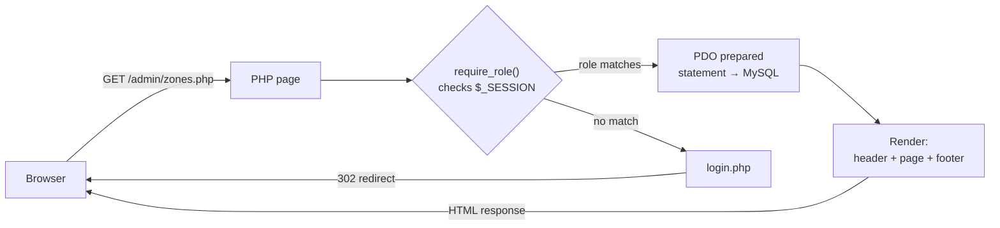
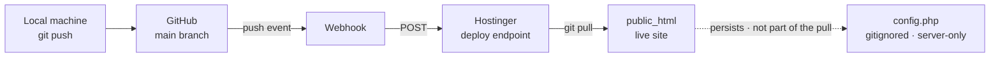
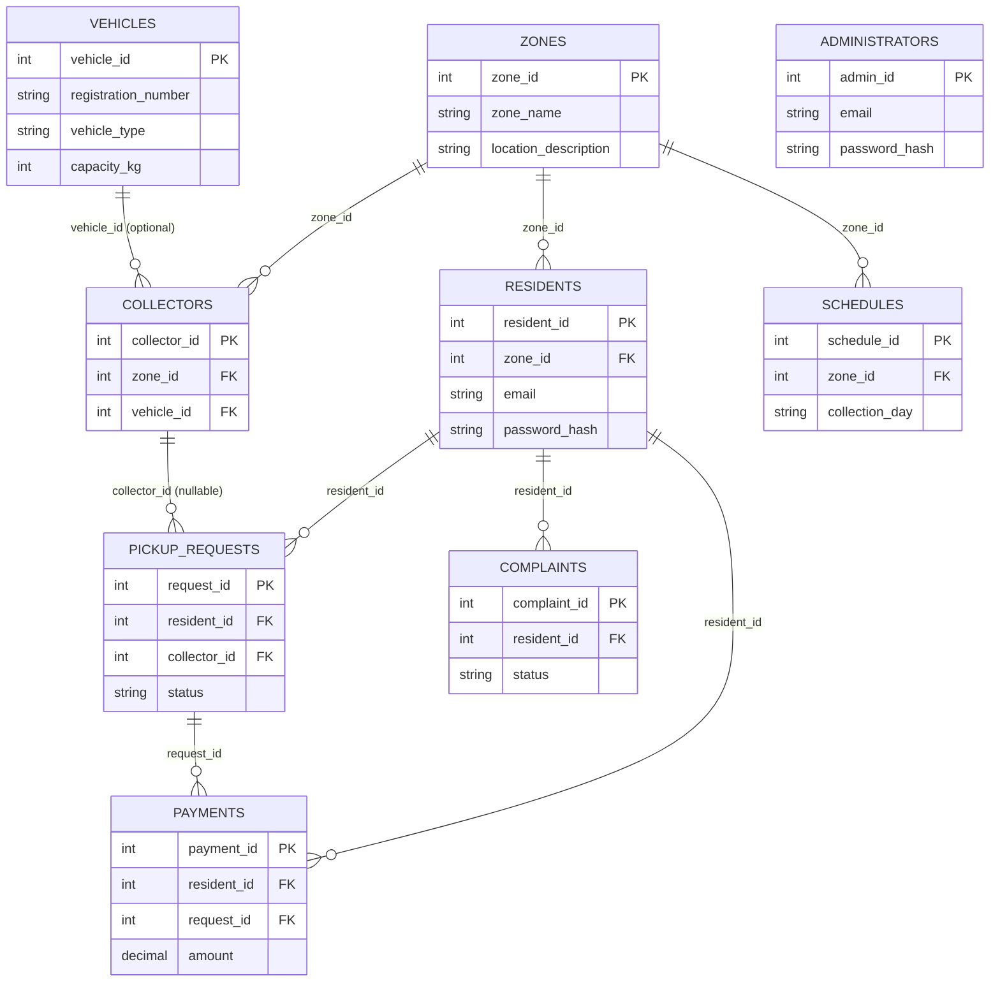
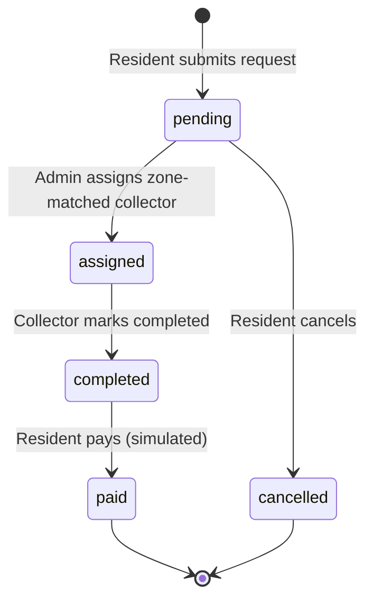

# Community Waste Collection Management System — Presentation & Technical Guide

**Group 6** · Phillip Ssempereza · Mwondha Andrew · Sserunjogi Muhammad · Kimoga Sudais

A companion for the whole team: how the system is architected, how the database is
designed, how the interface is organized, and a script to run the live defense from.
This is a walkthrough guide, not a replacement for the full project report.

- Repo: [Phillipsein/community-waste-collection-management-system](https://github.com/Phillipsein/community-waste-collection-management-system)
- Live site: [group6-project.philltechs.com](https://group6-project.philltechs.com)

> Diagrams below are Mermaid — GitHub renders them automatically when you view this
> file on github.com. In a plain local Markdown preview (e.g. VS Code without the
> Mermaid extension) they'll show as code blocks instead of pictures.

## Contents

1. [Overview](#1-overview)
2. [System Architecture](#2-system-architecture)
3. [Database Design](#3-database-design)
4. [Roles & Interface](#4-roles--interface)
5. [Core Workflow](#5-core-workflow)
6. [Security Measures](#6-security-measures)
7. [Setup & Deployment](#7-setup--deployment)
8. [Presentation Script](#8-presentation-script)

---

## 1. Overview

Waste pickup in most residential communities is coordinated informally — a phone
call to a collector, a note passed to a neighbour, no shared record of what was
requested, when it's due, or whether it's been paid for. Nobody has a single view
of the zone's schedule, the fleet, or which complaints are still open.

This system replaces that with one shared, role-gated record. A resident requests a
pickup and pays for it once it's done; a collector works from a queue of what's
assigned to them; an administrator runs the zones, the schedule, the fleet, and the
staff, and can see the whole operation's numbers on one dashboard.

| Role | What they do |
|---|---|
| **Resident** | Registers, submits pickup requests, tracks status, pays once a pickup is completed, raises complaints. |
| **Waste Collector** | Sees only the requests assigned to them in their zone, marks each one completed once collected. |
| **Administrator** | Manages zones, schedules, vehicles, and collector accounts; assigns requests; resolves complaints; reads the reports. |

---

## 2. System Architecture

The build brief was explicit: plain PHP, no framework, no Composer, no build step —
ordinary Hostinger shared hosting with no SSH access. That constraint shaped the
architecture directly: **one PHP file per page**, each file both the URL endpoint
and the logic for that page, with no router in between. Open `admin/zones.php` and
you're looking at everything that page does, top to bottom.

Every page under `resident/`, `collector/`, and `admin/` starts with the same call,
before any HTML is written: `require_role('resident')`. That's the entire
access-control layer — no middleware stack, just a function that checks the PHP
session and redirects to `login.php` if the role doesn't match.

*There's no router: the file the browser asks for **is** the controller. Every
protected page opens with a session check that either sends the visitor to
`login.php` or lets the rest of the file run.*

### Stack & why

| Layer | Choice | Why |
|---|---|---|
| Backend | PHP 8.1+, procedural | Runs on shared hosting with no Composer/SSH; any file is readable top to bottom by a lecturer who's never seen the codebase. |
| Database | MySQL/MariaDB via PDO | Prepared statements only, everywhere a user value touches a query — no string concatenation into SQL. |
| Frontend | Bootstrap 5 (CDN) + `style.css` | No build step. One stylesheet carries the brand palette on top of Bootstrap's components. |
| Auth | Native PHP sessions | No third-party auth library; `password_hash()` / `password_verify()` plus a role stored in `$_SESSION`. |
| JS | Vanilla, minimal | Only for things HTML/CSS can't do alone — confirm dialogs on cancel and delete actions. |

### Deployment pipeline

The GitHub repo is the source of truth. A push to `main` fires a webhook that
Hostinger listens on, which pulls the new code straight into `public_html` — no
manual FTP step.

*`config.php` holds the real database credentials and is deliberately excluded from
git (`.gitignore`) — only the placeholder `config.sample.php` is tracked. It's
created once by hand on the server, and every later auto-deploy leaves it alone.*

---

## 3. Database Design

Nine tables, mirroring the ERD in the project report exactly. `zones` is the hub —
every resident, every collector, and every schedule belongs to one. `administrators`
is deliberately standalone: it manages the system rather than participating in the
operational data, so it carries no foreign keys.

*`ADMINISTRATORS` appears with no relationship lines on purpose — it has no foreign
keys at all.*

### Full schema reference

| Table | Key columns | Purpose |
|---|---|---|
| `zones` | `zone_id` PK | The geographic units the whole system is organised around. |
| `administrators` | `admin_id` PK · `email` UNIQUE | Staff accounts that manage the system. Seeded, not self-registered. |
| `vehicles` | `vehicle_id` PK | The fleet — registration, type, capacity. |
| `residents` | `resident_id` PK · `zone_id` FK · `email` UNIQUE | Self-registered residents, each in exactly one zone. |
| `collectors` | `collector_id` PK · `zone_id` FK · `vehicle_id` FK | Staff accounts created by an admin, each assigned a zone and (optionally) a vehicle. |
| `schedules` | `schedule_id` PK · `zone_id` FK | Recurring collection day / time / frequency per zone. |
| `pickup_requests` | `request_id` PK · `resident_id` FK · `collector_id` FK | The core record: one resident's request, its waste type, date, and status. |
| `payments` | `payment_id` PK · `resident_id`, `request_id` FK | A simulated payment against one completed request. |
| `complaints` | `complaint_id` PK · `resident_id` FK | A resident's complaint and, once resolved, the admin's response. |

Full `CREATE TABLE` statements: [`sql/schema.sql`](sql/schema.sql).

---

## 4. Roles & Interface

Every role gets the same navbar and footer shell — only the links change. No
sidebars, no separate admin theme; the whole system reads as one consistent
product.

| Role | Page | Path | Purpose |
|---|---|---|---|
| Resident | Dashboard | `resident/dashboard.php` | Pending/completed counts, zone's next collection. |
| Resident | Request Pickup | `resident/request_pickup.php` | Submit a new pickup request. |
| Resident | My Requests | `resident/my_requests.php` | Status per request, Pay button, cancel while pending. |
| Resident | Schedule | `resident/schedule.php` | Read-only view of the zone's collection days. |
| Resident | Pay | `resident/pay.php` | Simulated payment for one completed request. |
| Resident | Complaints | `resident/complaints.php` | Submit and track complaints. |
| Collector | Dashboard | `collector/dashboard.php` | Assigned vs. completed counts. |
| Collector | My Requests | `collector/my_requests.php` | Assigned queue, Mark Completed. |
| Administrator | Dashboard | `admin/dashboard.php` | System-wide counters. |
| Administrator | Zones / Schedules / Vehicles | `admin/zones.php` etc. | Full CRUD on each. |
| Administrator | Collectors | `admin/collectors.php` | Create collector accounts, assign zone & vehicle. |
| Administrator | Requests | `admin/requests.php` | Assign a zone-matched collector to a pending request. |
| Administrator | Complaints | `admin/complaints.php` | Respond and resolve. |
| Administrator | Reports | `admin/reports.php` | Date-ranged counts and totals. |

### Visual language

The live palette, pulled straight from [`assets/css/style.css`](assets/css/style.css)
— the same colours as the report and the defense slides.

| Colour | Hex | Role |
|---|---|---|
| Forest | `#2C5F2D` | Primary — navbar, footer, headings |
| Moss | `#97BC62` | Secondary — status accents |
| Gold | `#C98A2C` | Accent, used sparingly — Pay button, key highlights |
| Paper | `#F4F6F2` | Background |
| Ink | `#222222` | Body text |

Component patterns: a top navbar in forest green with white text; Bootstrap cards
and tables for content; pill-shaped status badges colour-coded per state
(`pending` moss, `assigned` blue, `completed` forest, `cancelled` grey, `open` gold,
`resolved`/`paid` forest); the gold accent reserved for the one action that matters
most on a page (Pay, Add, Assign).

---

## 5. Core Workflow

Every pickup request moves through the same life, and each transition belongs to a
specific role — nobody but the resident cancels, nobody but the admin assigns,
nobody but the collector completes.

"Paid" isn't a status on the request itself — it's inferred from whether a
`payments` row exists for it, which is why the Pay button on `my_requests.php`
only shows for a completed request with none yet.

**Complaints run a simpler two-state life:** a resident submits one as `open`; an
administrator writes a response and marks it `resolved`. The resident sees that
response on their own Complaints page the moment it's saved — no separate
notification step.

---

## 6. Security Measures

Deliberately simple, matching the project's scope — but every basic that a class
defense panel will ask about is covered.

| Measure | Where | Why it matters |
|---|---|---|
| Prepared statements | `includes/db.php` | Every query touching user input goes through PDO with bound parameters — no string-concatenated SQL, anywhere. |
| Password hashing | `register.php`, `admin/collectors.php` | `password_hash()` / `password_verify()` — passwords are never stored or compared in plain text. |
| Role gate | `includes/auth.php → require_role()` | Called before any output on every protected page; wrong role or no session → redirect to login. |
| Output escaping | Every page | `htmlspecialchars()` on all dynamic output — verified directly with a script-tag complaint submission. |
| Vague login errors | `login.php` | One generic message either way — never reveals whether the email or the password was wrong. |
| Errors hidden, still logged | `config.php` | `display_errors=0`, `log_errors=1` — visitors never see a raw PHP error; the server log still has it. |
| Credentials never committed | `.gitignore` → `config.php` | Only the placeholder `config.sample.php` is tracked in git. |

Out of scope on purpose, per the project brief: CSRF tokens, rate limiting, email
verification, password reset. Worth naming as deliberate scope decisions if asked,
not gaps.

---

## 7. Setup & Deployment

### Run it locally

1. Install XAMPP/WAMP/Laragon (PHP 8.1+, MySQL).
2. Create a database, import `sql/schema.sql` then `sql/seed.sql`.
3. `config.php` already has working local defaults — edit only if your setup differs.
4. Point the document root at the project folder, open `index.php`.

### Ship it live

1. Push to `main` — the GitHub webhook triggers Hostinger's auto-deploy.
2. First deploy only: create `config.php` by hand in hPanel's File Manager (it's
   gitignored).
3. Import `schema.sql` + `seed.sql` once, via phpMyAdmin.
4. Visit [group6-project.philltechs.com](https://group6-project.philltechs.com) and
   confirm each seeded role logs in.

### Demo accounts

Seeded test accounts for the live demo — not real user data.

| Role | Email | Password |
|---|---|---|
| Administrator | `admin@group6.test` | `Admin@123` |
| Collector (Zone A) | `collector1@group6.test` | `Collector@123` |
| Collector (Zone B / C) | `collector2` / `3@group6.test` | `Collector@123` |
| Resident (any zone) | `resident1`–`6@group6.test` | `Resident@123` |

---

## 8. Presentation Script

A suggested run-of-show — enough to demonstrate the full request lifecycle across
all three roles in one continuous pass, five to seven minutes.

| Step | Show | As | Say |
|---|---|---|---|
| 1 | Landing page → About | — | The problem this replaces, then the four of us on the About page. |
| 2 | Register, land on dashboard | New resident | Self-registration is a resident-only feature — staff accounts are seeded or admin-created. |
| 3 | Request Pickup → My Requests | Resident | Request goes in as `pending`, no collector yet. |
| 4 | Dashboard counters, then Requests → Assign | Administrator | The dropdown only offers collectors from the resident's own zone — enforced server-side too. |
| 5 | My Requests → Mark Completed | Collector | Collectors only ever see their own assigned queue. |
| 6 | My Requests → Pay | Resident | Simulated payment — flat fee by waste type, clearly labelled as simulated. |
| 7 | Reports page | Administrator | Numbers just moved — the whole demo is reflected live in the report. |
| 8 | Submit a complaint → resolve it | Resident then Admin | The resident sees the response the moment it's saved. |

### Likely questions

**Q: Why plain PHP and not a framework?**
A: Hostinger shared hosting here has no SSH or Composer access — the brief called
for files that run as uploaded, and for any file to be readable top to bottom
without knowing a framework's conventions.

**Q: How is SQL injection prevented?**
A: Every query goes through PDO prepared statements with bound parameters —
nowhere does user input get concatenated into a query string.

**Q: Why is the payment simulated?**
A: Real mobile money integration was explicitly out of scope for this prototype;
the page states plainly that it's simulated rather than pretending otherwise.

**Q: How is access control enforced per role?**
A: `require_role()` runs at the very top of every protected page, before any
output, checking the session — not just hiding a nav link.

**Q: What would change for a production version?**
A: CSRF tokens, rate limiting, real payment gateway integration, email
verification, and a password reset flow — all named explicitly as future work
rather than omitted quietly.

**Q: Why UGX and MTN/Airtel Money as payment options?**
A: The report is written for the Ugandan urban context this system targets — those
are the payment methods residents there actually use.

---

*Group 6 · Community Waste Collection Management System · prepared as a technical
and presentation companion, not a replacement for the full project report.*
